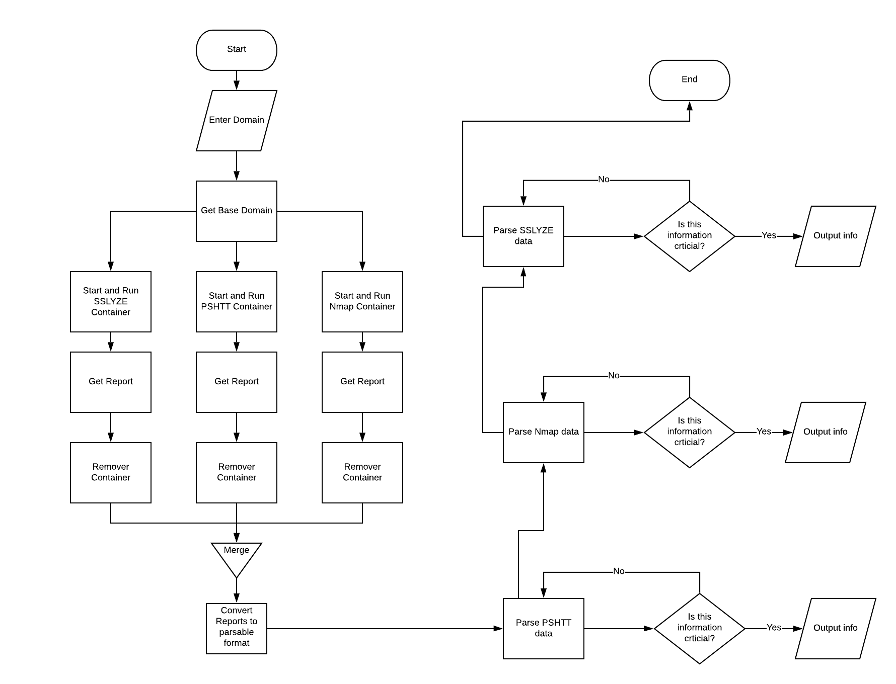

# BEACHCOMBER WEB Security Scanner

## What is BEACHCOMBER WEB?

BEACHCOMBER II is a docker based, containerized, multiprocessing based toolchain for security scans of your domain and generates a report outlining the possible vulnerabilities indicated in the various scans. XX scans also output the full scans from each of its services in a parsable format (XML, JSON or CSV) for further analysis. Future iterations of this project include the development of a user friendly graphical interface which would be easily accessible to users who are not experience with the command line interface. 

## The Purpose

The typical way to ensure application security is to hire a security specialist (aka penetration tester) at some point in your project to check the application for security bugs and vulnerabilities. Specialists of this type can cost a company or developer tens of thousands of dollars. Often small business and startups do not yet have the finances to hire a security specialist, so their domains are left vulnerable. The main purpose of this project is to promote cyber security by providing a tool for individuals who are not security professionals to conduct basic penetration test scans on their domains.

The purpose of XX is not to replace the penetration testers or make them obsolete. We strongly recommend to run extensive tests by experienced penetration testers whenever it is financially feasible for you.

## Getting Started

1.	Download or clone the repository
2.	This tool depends on the following Python mpdules: docker, multiprocessing, pandas, xmltodict, tarfile, json, tldextract. Please ensure these modules are in your Python environment.
3.	Open the config.txt file and change the path of 'home_dir' to whichever directory you would like scan reports to save to.
4.  Download Docker Desktop here: https://www.docker.com/products/docker-desktop
5.  Run Docker Deskptop
5.	Run program with the command ‘python main.py’
6.  When prompted, enter the domain you would like to scan.

## How it works

XX uses a very simple multi-processing based model to run the containers, and then conducts the parsing and output in a script-like single process.

The most important goal of the architecture is to build the whole toolchain highly containerized, extensible, and scalable. Therefore, we decided to provision the various parts with Docker as infrastructure. This design enables the extension of new components by adding a new container as an independent microservice and integrating it with the core engine.

## The Scanners

The scanners included are PSHTT, SSLYZE and Nmap. Every tool runs in its own Docker container. This allows users to easily add and integrate a new tool as a scanner, based on a language or technology of your choice, given that it can run inside Docker.

### PSHTT

The following information is an except from the PSHTT github repo (https://github.com/cisagov/pshtt):

`pshtt` (_"pushed"_) is a tool to scan domains for HTTPS best
practices. It saves its results to a CSV (or JSON) file.

`pshtt` was developed to _push_ organizations — especially large ones
like the US Federal Government :us: — to adopt HTTPS across the
enterprise. Federal agencies must comply with
[M-15-13](https://https.cio.gov), a 2015 memorandum from the White
House Office of Management and Budget, and [BOD
18-01](https://cyber.dhs.gov/bod/18-01/), a 2017 directive from the
Department of Homeland Security, which require federal agencies to
enforce HTTPS on their public web services. Much has been done, but
there's [more yet to
do](https://18f.gsa.gov/2017/01/04/tracking-the-us-governments-progress-on-moving-https/).

`pshtt` is a collaboration between the Cyber and Infrastructure
Security Agency's [National Cybersecurity Assessments and Technical
Services (NCATS) team](https://github.com/cisagov) and [the General
Service Administration's 18F team](https://18f.gsa.gov), with
[contributions from NASA, Lawrence Livermore National Laboratory, and
various non-governmental
organizations](https://github.com/cisagov/pshtt/graphs/contributors).

#### What's Checked?

A domain is checked on its four endpoints:
* `http://`
* `http://www`
* `https://`
* `https://www`

The following values are returned in `results.csv`:
#### Domain and redirect info 

* `Domain` - The domain you're scanning!
* `Base Domain` - The base domain of `Domain`. For example, for a
  Domain of `sub.example.com`, the Base Domain will be
  `example.com`. Usually this is the second-level domain, but `pshtt`
  will download and factor in the [Public Suffix
  List](https://publicsuffix.org) when calculating the base
  domain. (To cache the Public Suffix List, use `--suffix-cache` as
  documented above.)
* `Canonical URL` - One of the four endpoints described above; a
  judgment call based on the observed redirect logic of the domain.
* `Live` - The domain is "live" if any endpoint is live.
* `HTTPS Live` - The domain is "HTTPS live" if any HTTPS endpoint is
  live.
* `HTTPS Full Connection` - The domain is "fully connected" if any
  HTTPS endpoint is fully connected.  A "fully connected" HTTPS
  endpoint is one with which pshtt could make a full TLS connection.
* `HTTPS Client Auth Required` - A domain requires client
  authentication if *any* HTTPS endpoint requires it for a full TLS
  connection.
* `Redirect` - The domain is a "redirect domain" if at least one
  endpoint is a redirect, and all endpoints are either redirects or
  down.
* `Redirect to` - If a domain is a "redirect domain", where does it
  redirect to?

#### Landing on HTTPS 

* `Valid HTTPS` - A domain has "valid HTTPS" if it responds on port
  443 at the hostname in its Canonical URL with an unexpired valid
  certificate for the hostname. This can be true even if the Canonical
  URL uses HTTP.
* `HTTPS Publicly Trusted` - A domain is "publicly trusted" if its
  canonical endpoint has a publicly trusted certificate.
* `HTTPS Custom Truststore Trusted` - A domain is "custom truststore
  trusted" if its canonical endpoint has a certificate that is trusted
  by the custom truststore.
* `Defaults to HTTPS` - A domain "defaults to HTTPS" if its canonical
  endpoint uses HTTPS.
* `Downgrades HTTPS` - A domain "downgrades HTTPS" if HTTPS is
  supported in some way, but its canonical HTTPS endpoint immediately
  redirects internally to HTTP.
* `Strictly Forces HTTPS` - This is different than whether a domain
  "defaults" to HTTPS. A domain "Strictly Forces HTTPS" if one of the
  HTTPS endpoints is "live", and if both HTTP endpoints are either
  down or redirect immediately to any HTTPS URI. An HTTP redirect can
  go to HTTPS on another domain, as long as it's immediate. (A domain
  with an invalid cert can still be enforcing HTTPS.)

#### Common errors 

* `HTTPS Bad Chain` - A domain has a bad chain if either HTTPS
  endpoint contains a bad chain.
* `HTTPS Bad Hostname` - A domain has a bad hostname if either HTTPS
  endpoint fails hostname validation.
* `HTTPS Expired Cert` - A domain has an expired certificate if either
  HTTPS endpoint has an expired certificate.
* `HTTPS Self-Signed Cert` - A domain has a self-signed certificate if
  either HTTPS endpoint has a self-signed certificate.
* `HTTPS Probably Missing Intermediate Cert` - A domain is "probably
  missing intermediate certificate" if the canonical HTTPS endpoint is
  probably missing an intermediate certificate.

#### HSTS

* `HSTS` - A domain has HTTP Strict Transport Security enabled if its
  canonical HTTPS endpoint has HSTS enabled.
* `HSTS Header` - This field provides a domain's HSTS header at its
  canonical endpoint.
* `HSTS Max Age` - A domain's HSTS max-age is its canonical endpoint's
  max-age.
* `HSTS Entire Domain` - A domain has HSTS enabled for the entire
  domain if its **root HTTPS endpoint** (_not the canonical HTTPS
  endpoint_) has HSTS enabled and uses the HSTS `includeSubDomains`
  flag.
* `HSTS Preload Ready` - A domain is HSTS "preload ready" if its
  **root HTTPS endpoint** (_not the canonical HTTPS endpoint_) has
  HSTS enabled, has a max-age of at least 18 weeks, and uses the
  `includeSubDomains` and `preload` flag.
* `HSTS Preload Pending` - A domain is "preload pending" when it
  appears in the [Chrome preload pending
  list](https://hstspreload.org/api/v2/pending) with the
  `include_subdomains` flag equal to `true`.  The intent of `pshtt` is
  to make sure that the user is _fully_ protected, so it only counts
  domains as HSTS preloaded if they are _fully_ HSTS preloaded
  (meaning that all subdomains are included as well).
* `HSTS Preloaded` - A domain is HSTS preloaded if its domain name
  appears in the [Chrome preload
  list](https://chromium.googlesource.com/chromium/src/net/+/master/http/transport_security_state_static.json)
  with the `include_subdomains` flag equal to `true`, regardless of
  what header is present on any endpoint.  The intent of `pshtt` is to
  make sure that the user is _fully_ protected, so it only counts
  domains as HSTS preloaded if they are _fully_ HSTS preloaded
  (meaning that all subdomains are included as well).
* `Base Domain HSTS Preloaded` - A domain's base domain is HSTS
  preloaded if its base domain appears in the [Chrome preload
  list](https://chromium.googlesource.com/chromium/src/net/+/master/http/transport_security_state_static.json)
  with the `include_subdomains` flag equal to `true`. This is subtly
  different from `HSTS Entire Domain`, which inspects headers on the
  base domain to see if HSTS is set correctly to encompass the entire
  zone.

#### Scoring

These three fields use the previous results to come to high-level
conclusions about a domain's behavior.

* `Domain Supports HTTPS` - A domain 'Supports HTTPS' when it doesn't
  downgrade and has valid HTTPS, or when it doesn't downgrade and has
  a bad chain but not a bad hostname (a bad hostname makes it clear
  the domain isn't actively attempting to support HTTPS, whereas an
  incomplete chain is just a mistake.). Domains with a bad chain
  "support" HTTPS but user-side errors can be expected.
* `Domain Enforces HTTPS` - A domain that 'Enforces HTTPS' must
  'Support HTTPS' and default to HTTPS. For websites (where `Redirect`
  is `false`) they are allowed to _eventually_ redirect to an
  `https://` URI. For "redirect domains" (domains where the `Redirect`
  value is `true`) they must _immediately_ redirect clients to an
  `https://` URI (even if that URI is on another domain) in order to
  be said to enforce HTTPS.
* `Domain Uses Strong HSTS` - A domain 'Uses Strong HSTS' when the
  max-age ≥ 31536000.

### SSLYZE

The following is an except from the SSLYZE github repository:

SSLyze is a fast and powerful SSL/TLS scanning library.

It allows you to analyze the SSL/TLS configuration of a server by connecting to it, in order to detect various
issues (bad certificate, weak cipher suites, Heartbleed, ROBOT, TLS 1.3 support, etc.).

SSLyze can either be used as command line tool or as a Python library.

* Support for TLS 1.3 and early data (0-RTT) testing.
* Scans are automatically dispatched among multiple workers, making them very fast.
* Performance testing: session resumption and TLS tickets support.
* Security testing: weak cipher suites, insecure renegotiation, ROBOT, Heartbleed and more.
* Server certificate validation and revocation checking through OCSP stapling.
* Support for StartTLS handshakes on SMTP, XMPP, LDAP, POP, IMAP, RDP, PostGres and FTP.
* Scan results can be written to a JSON file for further processing.
* And much more!

### N-map

The following is an excerpt from nmap.org:

Nmap ("Network Mapper") is a free and open source (license) utility for network discovery and security auditing. Many systems and network administrators also find it useful for tasks such as network inventory, managing service upgrade schedules, and monitoring host or service uptime. Nmap uses raw IP packets in novel ways to determine what hosts are available on the network, what services (application name and version) those hosts are offering, what operating systems (and OS versions) they are running, what type of packet filters/firewalls are in use, and dozens of other characteristics. It was designed to rapidly scan large networks, but works fine against single hosts. 

### Coming Soon: Nikto, REST API's, GUI Interface

