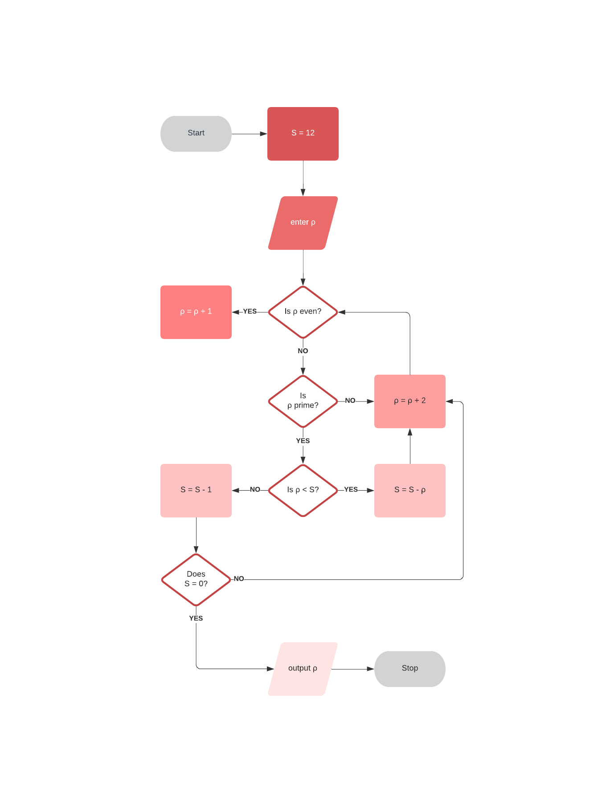

# XX

# What is XX?

XX is a docker based, containerize toolchain for security scans of your domain and generates a report outlining the possible vulnerabilities indicated in the various scans. XX scans also output the full scans from each of its services in a parsable format (XML, JSON or CSV) for further analysis. Future iterations of this project include the development of a user friendly graphical interface which would be easily accessible to users who are not experience with the command line interface. 

# The Purpose

The typical way to ensure application security is to hire a security specialist (aka penetration tester) at some point in your project to check the application for security bugs and vulnerabilities. Specialists of this type can cost a company or developer tens of thousands of dollars. Often small business and startups do not yet have the finances to hire a security specialist, so their domains are left vulnerable. The main purpose of this project is to promote cyber security by providing a tool for individuals who are not security professionals to conduct basic penetration test scans on their domains.

The purpose of XX is not to replace the penetration testers or make them obsolete. We strongly recommend to run extensive tests by experienced penetration testers whenever it is financially feasible for you.

# Getting Started

1.	Download or clone the repository
2.	This tool depends on the following Python mpdules: docker, multiprocessing, pandas, xmltodict, tarfile, json, tldextract. Please ensure these modules are in your Python environment.
3.	Open the main.py file and change the path of 'home_dir' to whichever directory you would like scan reports to save to.
4.  Download Docker Desktop here: https://www.docker.com/products/docker-desktop
5.	Run with the command ‘python main.py’
6.  When prompted, enter the domain you would like to scan.

# How it works

PSHTT: https://github.com/cisagov/pshtt
SSLYZE: https://github.com/nabla-c0d3/sslyze
Nmap: https://nmap.org
Nikto: https://github.com/sullo/nikto

This repository contains:

* SIGMA rule specification in this document
	
* Repository for sigma signatures in the sysmon-rules subfolder
	
* A tool which checks xml logs against the SIGMA rules

